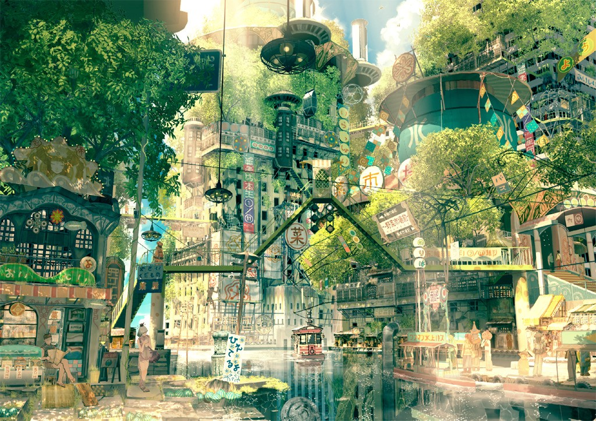

# kiezDAO: Reconnecting Neighbourhoods

As team behind [DEORA](https://www.deora.earth/) we think that we don't really know our neighbours as well, as past generations did. In the scope of [Blockchain for Social Impact](https://blockchainforsocialimpact.com/) we hope to build a platform that would reconnect neighbourhoods and allow communities to form. Since the goal is ambitious, we would start with small tool-sharing and tool-renting platform.

kiezDAO would allow interested people to advertise they own tools they would like to rent or share. The platform would notarialize all exchanges of tools on Ethereum blockchain so that people would have indisputable proof of who is supposedly holding given tool at a time. Likewise, we are thinking of a collateral or some other scheme to reduce trust needed to give expensive tools away and address possible risks. 

By promoting re-use of tools within a local community, we would reduce need to purchase new tools, acting in-line with Sustainable Development Goals related to Responsible Consumption and Production. It may also benefit less affluent members of society or frugal hobbyists, as they would have better access to tools that they could not afford to buy. 

We are hoping to test our solution in a real neighbourhood to see how it performs and what actual users think of the idea. 

