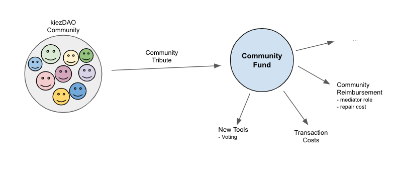

# Community Fund
**People are stronger together.**

The Community Fund is the solidary support inside the kiezDAO community.

The community helps individual members in rare cases and necessary situations. It also incentivizes behavior that helps the DAO to sustain in the long run. 

The Community Fund can assist in many occasions. For the kiezDAO we see it as an insurance/reimbursement backup, operations assistant (transaction costs), an option to buy new tools through an existing governance structure from the members themselves. 

The community fund and the respective common good it posses helps to switch from an individualistic tool sharing platform to a holistic, community driven organisation owned by the people.

Many more ideas can be derived from a community owned fund and governance structure. 