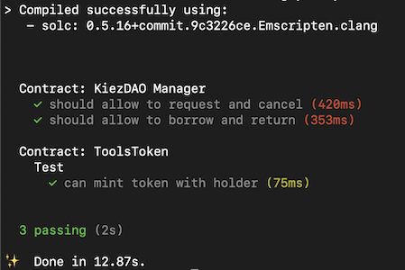

# KiezDAO Contracts

The Manager Contract connects [cUSD](https://integration-blockscout.celo-testnet.org/tokens/0x095531c4a946623aac5b3a98e4f01701ab25a8e6) and KDT, a ERC721 token contract. Lender and Borrower take tools traked by the KDT token through of livecycle of (P)ublication, (R)equests, (I)ssuances, (C)alls and (W)ithdrawal. **cUSD** acts as stake, fee and contribution payment. 


## Usage


### publishTool(uint256, uint256, bytes32)

A lender publishes a tool that can now be borrowed - A tool token is approved to manager contract. The lender sets the item value and description. The tool token is pulled into the ownership of the manager contract. 

```solidity
function publishTool(uint256 toolId, uint256 value, bytes32 description) public {}
```

#### Example in JS:
```javascript
await tools.approve(manager.address, toolId, {from: lender});
await manager.publishTool(toolId, 100, '0x', {from: lender});
```


### request(uint256)

A borrower request a tool after approving **cUSD** to the manager contract. The size of the approval is composed of stake (equals value), fee (1/10 of value) and contribution (1/10 of value). The request will pull the funds into the manager contract. An REQUEST event is emmited for the lender to see.
```solidity
function request(uint256 toolId) public {}
```

#### Example in JS:
```javascript
await cUSD.approve(manager.address, 120, {from: borrower});
const receipt = await manager.request(toolId, {from: borrower});
```

### issue(uint256, uint8, bytes32, bytes32)

Lender sends a issuance transaction including a signature by the borrower for receival of the tool. The tool is marked as issued, and can not be requested by other borrowers.

```solidity
function issue(uint256 toolId, uint8 sigV, bytes32 sigR, bytes32 sigS) public {}
```

#### Example in JS:
```javascript
await manager.issue(toolId, sig.v, sig.r, sig.s, {from: lender});
```

### call(uint256, uint8, bytes32, bytes32)

The borrow sends a call transaction including a signature by the lender that the tool has been returned in good condition. The stake (equals value) in cUSD is returned to the borrower. The fee (1/10 of value) in cUSD is paid to the lender, and a contribution (1/10 of value) in cUSD is sent to the community pool.

```solidity
function call(uint256 toolId, uint8 sigV, bytes32 sigR, bytes32 sigS) public {}
```

#### Example in JS:
```javascript
await manager.call(toolId, sig.v, sig.r, sig.s, {from: borrower});
```

## Testing

Run the unit-test with the following command:
```
yarn test
```



## Deployment

Deploy KiezDAO manager and token to Alfajores testnet using truffle:
```
export NETWORK_ID=44786
export CUSD_ADDR=0x095531c4a946623aac5b3a98e4f01701ab25a8e6
yarn deploy
```
