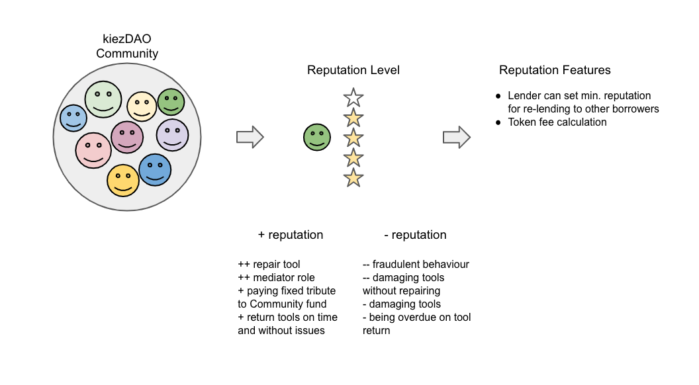

# Reputation System

In a small community where everybody knows everyone reputation is known on a social level and not quantifiable. KiezDAO aims to reach not only small but also larger communities where peers might not know each other personally. A reputation system can help to show transparency and trust.

Reputation in kiezDAO can be earned and slashed based on several factors. See img. 

Reputation can be extended with many features and dependencies. For a simpler understanding reputation for now is limited to two factors:
 - indicator for others to judge their trust in this person (permission to re-lend to other borrowers) 
 - token fee calculation (low reputation higher token premium / high reputation lower token cost)

