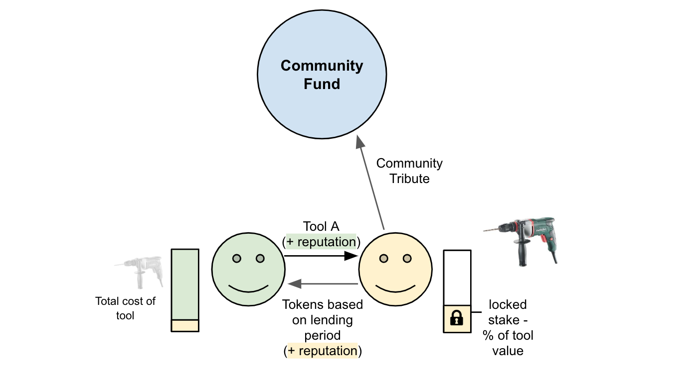
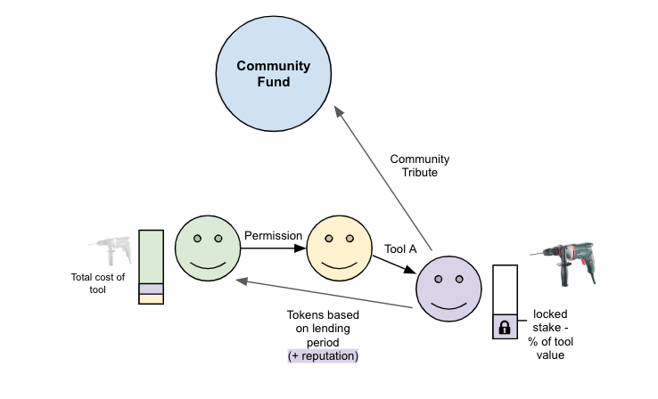

# User Scenarios  

There can be many scenarios within a lender-borrower relationship. We want to cover the most common and give an outlook on how disputes are managed within a solidary community such as kiezDAO.

## Scenario A
In over 95% of the time the following scenario will take place:

The lender will give a tool to a borrower in exchange for tokens over a period of time. By paying the tokens to the lender a tribute will be added to the community fund. Both parties earn positive reputation.

### Scenario A.1

If the tool owner gives the right permission the borrower can become a lender himself and borrow the item to next person. The status of ownership stays. The overall functionality is retained and the process recorded.

### Scenario A.2