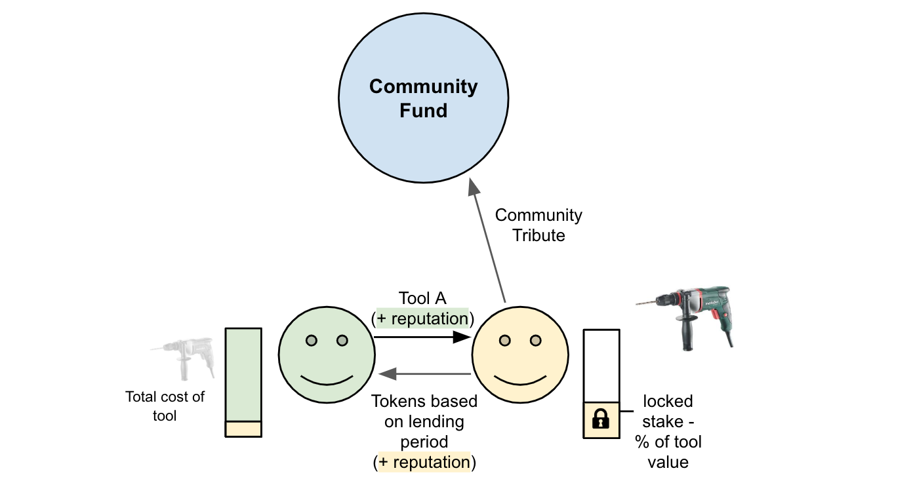
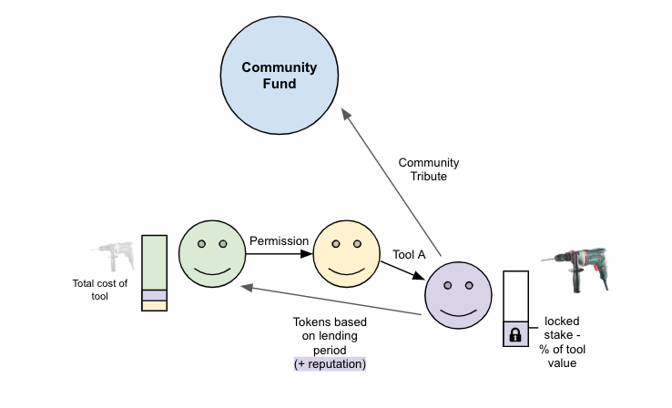
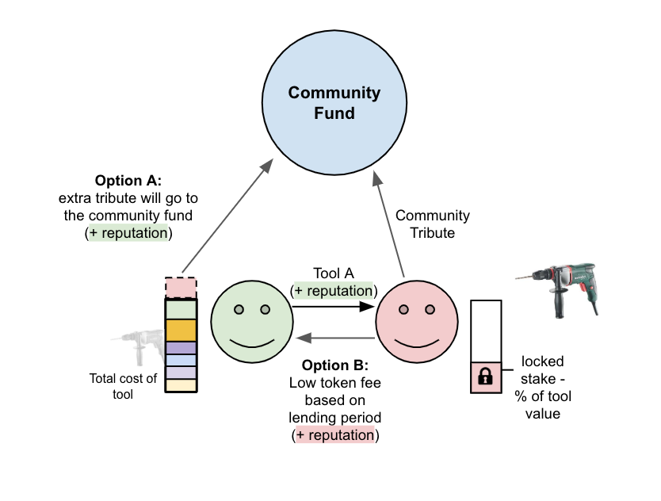
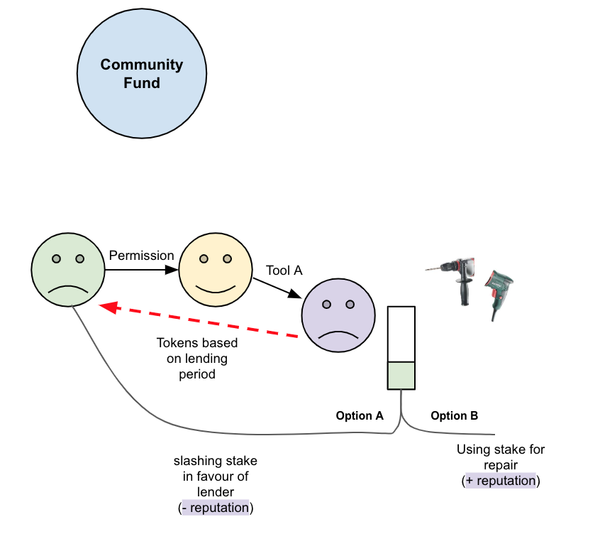
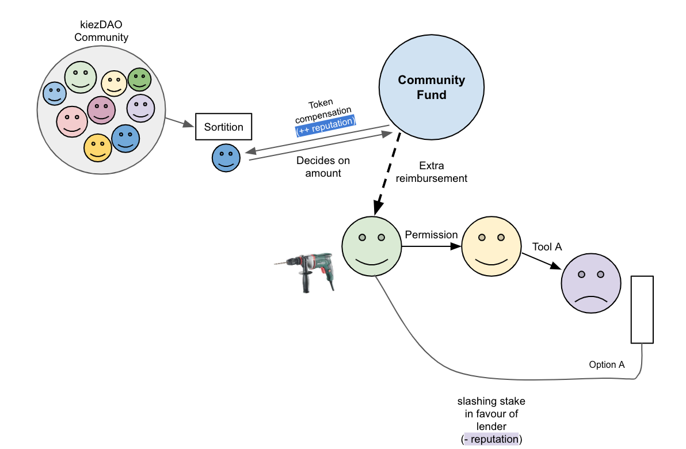
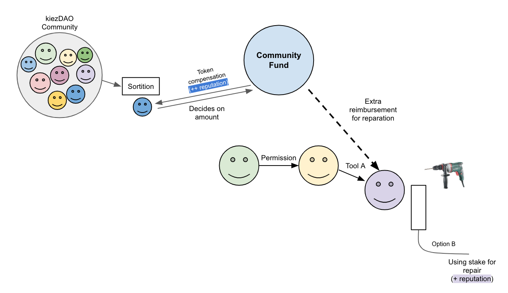

# User Scenarios  

There can be many scenarios within a lender-borrower relationship. We want to cover the most common and give an outlook on how disputes are managed within a solidary community such as kiezDAO.

## Scenario A
In over 95% of the time the following scenario will take place:

The lender will give a tool to a borrower in exchange for tokens over a period of time. By paying the tokens to the lender a tribute will be added to the community fund. Both parties earn positive reputation. 

### Scenario A.1

If the tool owner gives a defined permission the borrower can become a lender himself and borrow the item to the next person. The status of ownership stays. The overall functionality is retained and the process recorded.

### Scenario A.2

Every borrower sends tokens to the lender and therefore subsidizes his tools in exchange for it's usage. Over time the lender will have her initial payment of the tool fully covered and fully written off. Every member of the community can challenge the retail price (total cost) of the tool provided for the community (in case someone is pricing the retail price too high - to earn more tokens).

To promote a solidary community without a profit focus, we either incentivize a lower cost of renting the tool (meaning:the tool becomes part of the community) or increasing the community tribute by a stronger taxation of the tokens that would normally go to the lender (meaning: wealth tax to prevent monopolies). The initial owner will still get a token and reputation incentive.

## Scenario B

Unlikely but possible from time to time: a tool brakes or get's lost. In general as a security and motivation to take care of the tool a stake will be locked on the side of the borrower. This stake can be used to repair the tool itself or as a deposit for the lender. It is incentivized  for the borrower to repair it with the stake.

### Scenario B.1

In case the deposit for the owner is not enough to repair the tool the community fund can jump in for compensation (taking the face value of the tool into account). This functions as a community insurance. A case can be opened either from the lender or the borrower against a stake to prevent spamming. If a dispute for a specific case is coming up a mediator out of the community will be chosen by simple sortition. In exchange the chosen community member will be compensated in tokens and reputation for her services. 

### Scenario B.2

If the borrower can't come up the amount needed to repair the tool out of the provided stake the community fund can compensate here as well. See Scenario B.1.

The given scenarios are covering up 99% of the cases. Other cases need to be discussed inside individually and inside the community.
